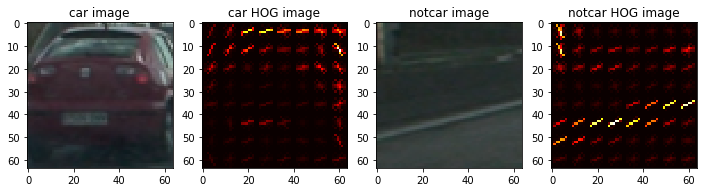
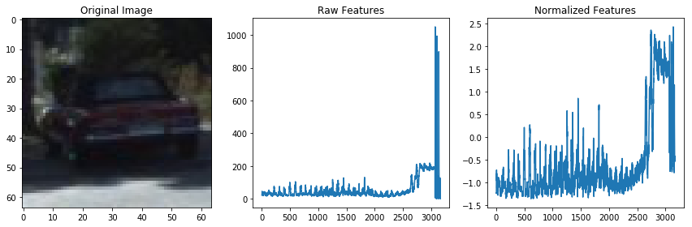
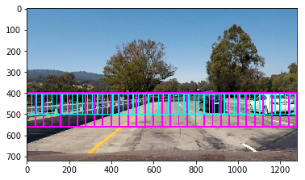
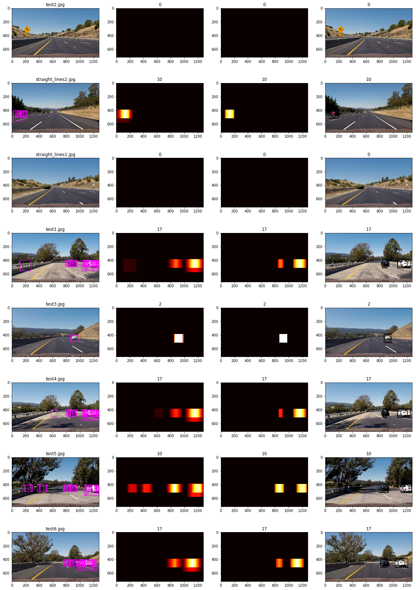

 ## Project Writeup

---

**Vehicle Detection Project**

The goals / steps of this project are the following:

* Perform a Histogram of Oriented Gradients (HOG) feature extraction on a labeled training set of images and train a classifier Linear SVM classifier
* Optionally, you can also apply a color transform and append binned color features, as well as histograms of color, to your HOG feature vector. 
* Note: for those first two steps don't forget to normalize your features and randomize a selection for training and testing.
* Implement a sliding-window technique and use your trained classifier to search for vehicles in images.
* Run your pipeline on a video stream (start with the test_video.mp4 and later implement on full project_video.mp4) and create a heat map of recurring detections frame by frame to reject outliers and follow detected vehicles.
* Estimate a bounding box for vehicles detected.

## [Rubric](https://review.udacity.com/#!/rubrics/513/view) Points
### Here I will consider the rubric points individually and describe how I addressed each point in my implementation.  

---
### Writeup / README

#### 1. Provide a Writeup / README that includes all the rubric points and how you addressed each one.  

You're reading it!

### Histogram of Oriented Gradients (HOG)

#### 1. Explain how (and identify where in your code) you extracted HOG features from the training images.

In order to extract the HOG features I used the hog function from the skimage.feature package.

The code for this step is contained in the third code cell of the following IPython notebook, under the *get_hog_features* function:

<i class="icon-file"></i> [vehicleDetection.ipnb](./vehicleDetection.ipnb)  

#### 2. Explain how you settled on your final choice of HOG parameters.

I then explored different color spaces and different `skimage.hog()` parameters (*color_space, orient, pixels_per_cell, cells_per_block*), and checked there outputs using images from the provided data set to get a feel for what the `skimage.hog()` output looks like. Those are the parameters I finally selected:

````
color_space = 'YCrCb' 
orient = 9  
pix_per_cell = 8 
cell_per_block = 2 
hog_channel = "ALL" 
````


Here is, as an example, the result for the final parameters on both car and not car image chosen randomly:



#### 3. Describe how (and identify where in your code) you trained a classifier using your selected HOG features (and color features if you used them).

As recommended in the project, I chose Linear SVC.
To feed the classifier, I brought together spatial, histogram and HOG features, and normalized it:



Then using the full image data set, I trained it.

Details from the data sets:

````
Car images count: 8792
Not car images count: 8968
````

After trying several parameters combinations, with the selected one I was able to reach once over 99% of successful classification, and always well above 98%. This variation is normal considering that the training set and the test set are always redefined at the beginning of the training.

Code: 6th and 4th cell (extract_features funtion) @ [vehicleDetection.ipnb](./vehicleDetection.ipnb) 

### Sliding Window Search

#### 1. Describe how (and identify where in your code) you implemented a sliding window search.  How did you decide what scales to search and how much to overlap windows?

Looking at the test images we can easily see a pattern of what a car is on the images. With that in mind, it was easy to understand that a full search over the complete image is useless and time consuming, once cars with a particular size can only be on a limited area of the image.

Since there is no cars in the sky (or not yet :-) ), at least the top part of the image can be discarded. Then, because the camera is on the top of the car, and it is pointing to the horizon, an acceptable approximation is that all the cars will be leveled by a line that goes around their tops. Besides that, the closer the car are the bigger they look on the image.

So my idea was to consider single lines of different window sizes leveled at the top (roughly, since I just change it in few pixels). That way, thinner lines would detect smaller/farther cars while thicker lines would detect bigger/closer cars.

So I started testing my idea using lines with 256 pixels high down to 32 px, by steps of 32 px, and started getting a better picture of what each one could achieve.

Unfortunately, for the sake of processing speed I could not afford to use all of them, so I filtered it based on the results achieved on the above tests and finally came to this windows layout:

- 1 line of 160 px high starting at line y=400
- 1 line of 96 px high starting at line y=404

I also used a 75% overlay of windows on both lines, since it managed to distinguish false detections (that have a more random behavior) from car detections. On the following image the windows resulting from this description can be seen:



That solution allowed me to get good enough results that could be bettered with post processing.

I used the recommended single HOG feature extraction for the whole frame to make the system faster. That approach is basically doing the same thing but in the opposite path. So, instead of resizing each window to the training size of 64x64, I did a single resize of the full image to be 64 px high.

Code: line 20 to 40 on the 10th cell, and line 25 on the 7th cell (find_cars_in_image funtion) @ [vehicleDetection.ipnb](./vehicleDetection.ipnb)  

#### 2. Show some examples of test images to demonstrate how your pipeline is working.  What did you do to optimize the performance of your classifier?

On the following image one can see the full steps on 8 different images.
- The first column represents the car detections out of the classifier
- The second represents the heatmap created with the detections from the first column
- The third column represents the previous column after filtering
- The last column represents the boudary boxes created out of the blobs provided by the label function over the filtered heatmap from the previous column


---

### Video Implementation

#### 1. Provide a link to your final video output.  Your pipeline should perform reasonably well on the entire project video (somewhat wobbly or unstable bounding boxes are ok as long as you are identifying the vehicles most of the time with minimal false positives.)
Here's a [link to my video result](./output_image/output_project_video_completed.mp4)

The thin yellow boxes show the detections out of the classifier. There we can see that some parts of the image can fool the classifier (like guards, mainly metallic ones over bridges, as well as dark traces over the whiter pavement), but since it mostly happens sporadically, using a valid filtering post-processing I managed to discard the majority of those false positives.

The thick red boxes are the tracking results out of the post-processing using spatial and temporal filtering, and can be considered as the tracking result.

The small green circle represents the center of the tracking box used for updating the motion vector of the detections (for future improvements).

#### 2. Describe how (and identify where in your code) you implemented some kind of filter for false positives and some method for combining overlapping bounding boxes.

Spatial filtering is used on each frame. The trick was to use a threshold level dependent of the detections (cars tend to be detected more often so the heatmap over them will have higher values). That allowed to achieve a very balanced filtering (avoiding to remove cars or keep to much false positives). That can be seen at the begining of the video when there is no cars, the lack of references doesn't allow the false detections *cleaning* to happen. But as soon as the white Lexus enters on the right side, the false detections are proportionally less important (lower values in the heatmap), and thus discarded and not considered as a tracking anymore.

Code: line 75 to 95 on the 10th cell @ [vehicleDetection.ipnb](./vehicleDetection.ipnb)

On the temporal side I considered the last 10 frames, that corresponds to 0.4 seconds on a video of 25 fps. I defined an object class to help storing detections. Then it was easy to retrieve and update them whenever they were considered as being a matching detection from the previous frames.

Code: line 50 to 55 on 10th the cell @ [vehicleDetection.ipnb](./vehicleDetection.ipnb)

---

### Discussion

#### 1. Briefly discuss any problems / issues you faced in your implementation of this project.  Where will your pipeline likely fail?  What could you do to make it more robust?

The most tricky parts (besides getting a bug free code when we are working late at night :-) ) are getting a light windows search and an efficient post processing.

It would have been easy to avoid looking to the left side of the image, but that would create a failure if we move the car to the right lanes (where it should have always been based, at least, on European laws :) ).

Bigger weaknesses of this system is when the car is passing by metallic rail guards and also tire marks on brighter pavements. That seems to really fool the system, and I believe the solution must be on getting an improved data set, since the detections of those features are longer in time and space, and thus hard to fully eliminate with both spatial and temporal filtering.

An improvement would be to do refined searches on limited small areas of the image, with smaller windows, where it would be expected to have a car based on the previous images. For that I added a variable (move) on the detection object to store the motion vector calculated using the detection centers from all the consecutive matches.  

In-line with what is required to stand out, this project was not just about doing a good detection, but also on doing it quite fast. Abusing on sliding windows would make it easier to get a better detection, but that would come at a price that would not justify it anymore.

As explained earlier, finding a good balance between detections and speed was the key here. My final choice was using one single line of windows with 160x160 pixels together with another line of 96x96 windows, both with a horizontal overlaping of 75%. That creates 156 windows, and seaching vehicles on them took a total processing time of 8.43 minutes for a total of 1260 frames of the video. That gives us an average of around 4.5 fps, which is not bad for a python code.
